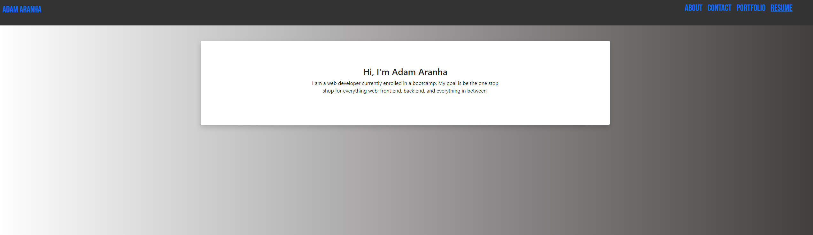

# React Portfolio

### Table of Contents  
[Description](#Description)\
[Install Instructions](#Install-Instructions)\
[Usage Information](#Usage-Information)\
[Contribution Guidelines](#Contribution-Guidelines)\
[Testing Guidelines](#Testing-Guidelines)\
[License](#License)\
[Questions](#Questions)

## Description
The official Portfolio of my Full-Stack Web Development caeer and apparently an endless supply of life lessons. This is a consant Work in Progress and will be periodically updated to showcase growing knowledge in this space..

## Install Instructions
.

## Usage Information
.

## Contribution Guidelines
.

## Testing Guidelines
.

## License
You are using the MIT license, click on the badge at the top of the page for more information.

## Questions
You can find me on [GitHub](https://github.com/AdamAranha) or you can reach me by email [here](mailto:a3aranha@gmail.com).

[Link to the Live Site](https://whispering-headland-03703.herokuapp.com/)

